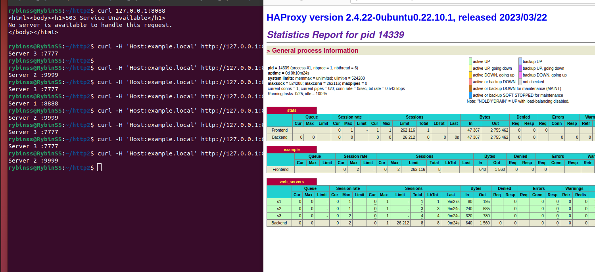

# hw_haproxy

### Задание 1

Что нужно сделать:

1.  Запустите два simple python сервера на своей виртуальной машине на разных портах.
2.  Установите и настройте HAProxy.  
3.  Настройте балансировку Round-robin на 4 уровне.  
4.  ДНа проверку направьте конфигурационный файл haproxy, скриншоты, где видно перенаправление запросов на разные серверы при обращении к HAProxy.  

 
 

[cfg](https://github.com/RybinSS/hw_haproxy/blob/main/file/haproxy2.cfg)

### Задание 2

1. Запустите три simple python сервера на своей виртуальной машине на разных портах.  
2. Настройте балансировку Weighted Round Robin на 7 уровне, чтобы первый сервер имел вес 2, второй - 3, а третий - 4.  
3. HAproxy должен балансировать только тот http-трафик, который адресован домену example.local  
4. На проверку направьте конфигурационный файл haproxy, скриншоты, где видно перенаправление запросов на разные серверы при обращении к HAProxy c использованием домена example.local и без него.  

 

[cfg](https://github.com/RybinSS/hw_haproxy/blob/main/file/haproxy1.cfg)  

